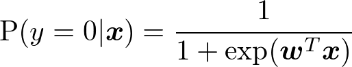
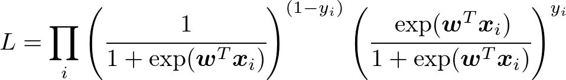
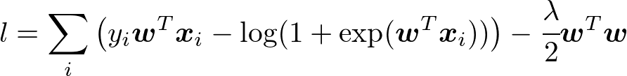
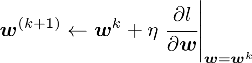
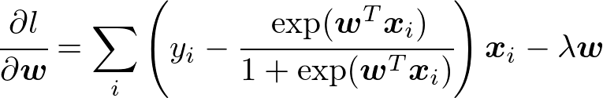

# Logistic_regression
Stochastic Gradient Descentによるロジスティック回帰の実装
## Note
In logistic regression, the probability that y=0 is estimated by

 .

Likelihood _L_ is 

 ,

and log likelihood with L2 regularization _l_ is

 .

We want to find _**w**_ that maximize _l_. Gradient descent can be used.

 

Partial Derivative of _l_ is calculated by the following equation. Data used to estimate partial derivative of _l_ is randomly selected in SGD.

 
